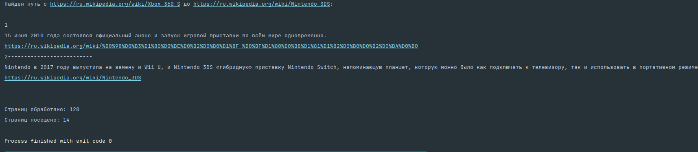

# InHouseAd
Тестовое задание для InHouseAd.
### Текст задания:

входные данные: 
1) 2 ссылки на wikipedia (можно из файла можно из консоли вводить)
2) ссылки за пределами wikipedia путем не считаются
3) вручную от одной страницы до второй можно дойти за 3 клика (см прмиер)
4) необходимо показать полный путь как пройти от ссылки 1 до ссылки 2. 
5) отображение пути должно для каждого шага должно содержать текст (полное предложение в котором эта ссылка найдена) и ссылку на следующую страницу
6) отображать это можно как в консоли так и в web
7) дополнительно можно вести лог файл со всеми страницами, что были посещены при поиске

Исходные ссылки: 
- стартовая - https://ru.wikipedia.org/wiki/Xbox_360_S
- конечная - https://ru.wikipedia.org/wiki/Nintendo_3DS

Ожидаемый вывод:
```
1------------------------
И 15 июня 2010 года Microsoft подтвердили их на выставке E³, объявив о прекращении производства старых версий Xbox 360 и скором старте продаж усовершенствованной версии консоли.
https://ru.wikipedia.org/wiki/Electronic_Entertainment_Expo
2-------------------------
Это совпало с появлением нового поколения консолей, в частности с выпуском Sega Saturn, и анонсами предстоящих релизов PlayStation, Virtual Boy и Neo Geo CD.
https://ru.wikipedia.org/wiki/Virtual_Boy
3-------------------------
Стереоскопическая технология в игровых приставках вновь появилась в более поздние годы и имела больший успех, включая портативную игровую приставку Nintendo 3DS
https://ru.wikipedia.org/wiki/Nintendo_3DS
```

Результат работы:
- github + readme файл с описание логики
- Файл скрипта + readme файл с описанием логики

<hr>

### Структура
1) main.py - точка входа, он же основной файл
2) settings.py - конфигурационный файл

<hr>

### Логика работы
1) Инициализируем очередь поиска. Структура [(url1, [path1]), (url2, [path2]), ...] <br>
Список, состоящий из кортежей вида: (url адрес страницы, [станицы, которые были перед ней])
2) Используя алгоритм поиска в ширину, создаем задачи для отправки запросов по каждому url адресу
3) Выполняем задачи, получая страницы
4) Каждую страницу разбираем по тегам, вытаскиваем все ссылки из блока 'bodyContent' вместе с предложениями, 
в которых встречаются.<br>
Расположение ссылок на странице, которые попадают в условия текущей реализации: <br>
    ```html
    <bodyContent>
        <p>
          Предложение
            <a href="/wiki/сама ссылка">
            </a>
          вокруг ссылки
        </p>
    </bodyContent>
    ```
5) Перебираем все ссылки, которые вытащили. 
   - Проверяем, не посещались ли они ранее
   - Собираем для каждой из них путь до неё (путь прошлого элемента + текущий)
   - Если ссылка совпадает с искомой - возвращаем путь текущей ссылки
   - Если длинна пути меньше заданной глубины поиска - добавляем ссылку + путь до неё в очередь на создание задач, иначе - пропускаем
6) Повторно проходимся по очереди. Если очередь пуста - ссылка не найдена.

<hr>

### Стэк
- Python 3.11
Библиотеки:
  - beautifulsoup4==4.11.2
  - aiohttp==3.8.4

<hr>

### Запуск

1) Сделать форк в свой репозиторий
2) Склонировать на локальную машину
3) В корне проекта:
```
python3 -m venv venv && source venv/bin/activate
pip install --upgrade pip && pip install -r requirements.txt
python3 main.py
```

### Примеры работы:
1) Неудачный поиск (не найдена ссылка) <br>
   <br><br>
2) Удачный поиск (входные данные из тз) <br>
   
3) Невалидные данные на вход <br>
  